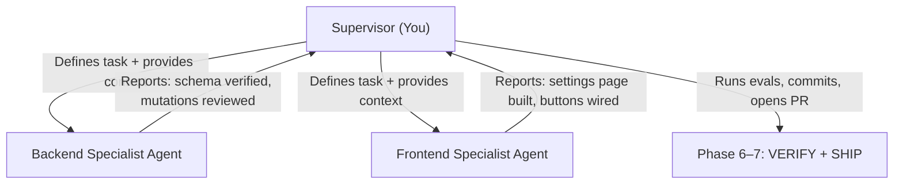

# Build Plugin Settings — erxes AI Native Post-Scaffold Playbook

> The companion to `create-plugin.md`. After a plugin is scaffolded, this skill fills in the **Settings page UI** and **wires the CRUD buttons** (Add, Edit, Delete) that `create-plugin.md` leaves as stubs.

---

# Playbook Initialization

> **When to use:** After `create-plugin.md` has run successfully and the plugin scaffold exists with:
> - An empty or stub Settings component (e.g., `<h1>Settings</h1>` with no real content)
> - A dead "Add" button with no `onClick` handler or form
> - Backend mutations that exist but are not wired to any UI

> **Pre-read (mandatory):**
> 1. [`../SYSTEM-PROMPT.md`](../SYSTEM-PROMPT.md) — constitution
> 2. [`../memory/lessons.md`](../memory/lessons.md) — past mistakes
> 3. [`../SLOP-CHECKLIST.md`](../SLOP-CHECKLIST.md) — forbidden patterns
> 4. The plugin's [`../plugins/<plugin>/INDEX.md`](../plugins/) — file map

---

## Non-Negotiable Rules

1. **Mirror a mature plugin's settings.** Read a working settings page (e.g., `SalesSettingsIndexPage.tsx`, `AccountingSettingsPage.tsx`, or `PosSettingsPage.tsx`) in full before generating any code.
2. **The backend already exists.** `create-plugin.md` scaffolded the GraphQL schema, resolvers, and Mongoose model. This skill does NOT re-create them — it reviews and wires them.
3. **Multi-tenancy is non-negotiable.** The backend model must use `subdomain` from `generateModels(subdomain)`. Verify this before proceeding. See [`../rules/30-multi-tenancy.md`](../rules/30-multi-tenancy.md).
4. **No dead buttons.** Every button visible in the UI must be wired to a real mutation or navigation action. A button that does nothing is slop.
5. **Sub-agent orchestration is mandatory for this skill.** This is a Large/Complex task by definition (spans DB review + GraphQL + React components + forms + state). Boot the Supervisor Model from [`start.md`](./start.md) Phase 3.

---

## Orchestration Architecture — Supervisor Model

This skill **requires** the Supervisor Model. The incoming AI (you) acts as the Supervisor and spawns exactly **2 specialist sub-agents**:



### Sub-agent 1: Backend Specialist

**Scope:** Review and harden the backend that `create-plugin.md` scaffolded.

**Context to provide in the prompt:**
- The plugin's `INDEX.md` content
- The full content of all backend files:
  - `backend/plugins/<plugin>_api/src/modules/<module>/db/definitions/<entity>.ts` — Mongoose schema
  - `backend/plugins/<plugin>_api/src/modules/<module>/db/models/<Entity>.ts` — model class
  - `backend/plugins/<plugin>_api/src/modules/<module>/graphql/schemas/<entity>.ts` — GraphQL types/queries/mutations
  - `backend/plugins/<plugin>_api/src/modules/<module>/graphql/resolvers/mutations/<entity>.ts` — mutation resolvers
  - `backend/plugins/<plugin>_api/src/modules/<module>/graphql/resolvers/queries/<entity>.ts` — query resolvers
  - `backend/plugins/<plugin>_api/src/modules/<module>/@types/<entity>.ts` — TypeScript interfaces
  - `backend/plugins/<plugin>_api/src/connectionResolvers.ts` — model registration
- The `rules/30-multi-tenancy.md` content
- The `rules/10-code-style.md` content

**Tasks:**
1. Verify `subdomain` is correctly passed through `generateModels(subdomain)` and used in the model's `create` method.
2. Verify query resolvers use correct pagination pattern (page/perPage).
3. Verify mutation resolvers receive `{ models }: IContext` and delegate to model static methods.
4. Add input validation at the GraphQL boundary (required fields, string length limits) if missing.
5. Verify the `@types` interface matches the Mongoose schema and GraphQL type definition (no type lies — see SLOP-CHECKLIST).
6. Run `.agents/evals/run.sh <plugin> --backend-only`. Report pass/fail.

**Done condition:** All backend files are consistent, multi-tenant-safe, and evals pass.

### Sub-agent 2: Frontend Specialist

**Scope:** Build the functional Settings page and wire all CRUD operations.

**Context to provide in the prompt:**
- The plugin's `INDEX.md` content
- The full content of all frontend files:
  - `frontend/plugins/<plugin>_ui/src/pages/<module>/IndexPage.tsx`
  - `frontend/plugins/<plugin>_ui/src/modules/<Module>Settings.tsx`
  - `frontend/plugins/<plugin>_ui/src/modules/<Module>SettingsNavigation.tsx`
  - `frontend/plugins/<plugin>_ui/src/modules/<Module>Navigation.tsx`
  - `frontend/plugins/<plugin>_ui/src/modules/<Module>Main.tsx`
  - `frontend/plugins/<plugin>_ui/src/modules/<module>/components/*.tsx`
  - `frontend/plugins/<plugin>_ui/src/modules/<module>/graphql/queries.ts`
  - `frontend/plugins/<plugin>_ui/src/modules/<module>/graphql/mutations.ts`
  - `frontend/plugins/<plugin>_ui/src/config.tsx`
- A **sister settings page** from a mature plugin — read in full. Recommended sisters:
  - `frontend/plugins/sales_ui/src/pages/SalesSettingsIndexPage.tsx` (canonical CRUD settings with boards list + form bar)
  - `frontend/plugins/accounting_ui/src/pages/SettingsPage.tsx` (simpler CRUD settings)
  - `frontend/plugins/tourism_ui/src/pages/tms/SettingsPage.tsx` (alternative pattern)
- The `SLOP-CHECKLIST.md` content

**Tasks:**
1. **Build `<EntityForm>` component** — a modal/dialog form with fields matching the GraphQL mutation inputs (`name`, `location`, `managerId`, etc.). Use `erxes-ui` components (`Dialog`, `Input`, `Button`, `Form`). Wire to `ADD_<ENTITY>` mutation for create, `EDIT_<ENTITY>` mutation for edit. Refetch the list query on success.
2. **Wire the "Add" button** in `IndexPage.tsx` — open the form modal in create mode with `useState` for modal visibility.
3. **Wire "Edit" and "Delete" actions** in the list component — "Edit" opens the form modal with pre-filled data; "Delete" calls the remove mutation with a confirmation dialog.
4. **Populate the Settings page** — replace the stub `<h1>Settings</h1>` with the real settings content. Route it properly via `<Module>Main.tsx`.
5. **Ensure all imports use `erxes-ui` and `ui-modules`** — no cross-plugin imports. See [`../rules/20-architecture-boundaries.md`](../rules/20-architecture-boundaries.md).
6. Run `.agents/evals/run.sh <plugin>`. Report pass/fail.

**Done condition:** Add/Edit/Delete buttons are functional, Settings page has content, evals pass.

---

## Phase 3 — GROUND (mirror an existing feature)

**Step 1 (mandatory): find the sister settings you will mirror.**

For this skill, the natural sisters are:

| Sister | Plugin | Path | Why |
|---|---|---|---|
| `SalesSettingsIndexPage` | sales | `frontend/plugins/sales_ui/src/pages/SalesSettingsIndexPage.tsx` | Canonical settings page with sub-routes + CRUD list + form bar |
| `PosSettingsPage` | sales | `frontend/plugins/sales_ui/src/pages/PosSettingsPage.tsx` | Simple CRUD settings with create dialog + card grid — best mirror for new plugins |
| `AccountingSettings` | accounting | `frontend/plugins/accounting_ui/src/modules/AccountingSettings.tsx` | Rich settings with sub-routing, sidebar, Zod forms, key-value config pattern |
| `MainSettingsForm` | accounting | `frontend/plugins/accounting_ui/src/modules/settings/components/MainSettingsForm.tsx` | Form pattern: `react-hook-form` + `zodResolver` + erxes-ui `<Form>` components |
| `Configs model` | accounting | `backend/plugins/accounting_api/src/modules/accounting/db/models/Configs.ts` | Backend key-value config model with `updateSingleByCode` pattern |

**Read these files in full** before writing any code:

### Frontend files to read (pick the closest sister):
- `frontend/plugins/sales_ui/src/pages/SalesSettingsIndexPage.tsx` — sub-routes, `SettingsHeader`, `PageContainer`
- `frontend/plugins/sales_ui/src/pages/PosSettingsPage.tsx` — create dialog + card grid (simpler)
- `frontend/plugins/sales_ui/src/modules/SalesSettingsNavigation.tsx` — how `pathPrefix` and `path` are set correctly
- `frontend/plugins/accounting_ui/src/modules/AccountingSettings.tsx` — rich sub-routing with sidebar
- `frontend/plugins/accounting_ui/src/modules/settings/components/MainSettingsForm.tsx` — Zod + react-hook-form pattern
- `frontend/plugins/accounting_ui/src/modules/settings/hooks/useMainConfigs.tsx` — Apollo query hook
- `frontend/plugins/accounting_ui/src/modules/settings/hooks/useMainUpdateConfigs.tsx` — Apollo mutation hook

### Backend files to read (if adding a config model):
- `backend/plugins/accounting_api/src/modules/accounting/db/definitions/config.ts` — schema with `code` + `value`
- `backend/plugins/accounting_api/src/modules/accounting/db/models/Configs.ts` — `updateSingleByCode` pattern
- `backend/plugins/accounting_api/src/modules/accounting/graphql/schemas/config.ts` — config GraphQL types
- `backend/plugins/accounting_api/src/modules/accounting/graphql/resolvers/mutations/configs.ts` — permission-gated mutations

The sub-agents must include their read file contents in the GROUND.md artifact.

## Phase 4 — PLAN

Default plan for post-scaffold settings build:

1. **[Backend] Review & harden the scaffolded backend** — files: all `backend/plugins/<plugin>_api/src/modules/` files. Verify multi-tenancy, type parity, input validation.
2. **[Frontend] Create `<EntityForm>` component** — files: `frontend/plugins/<plugin>_ui/src/modules/<module>/components/<EntityForm>.tsx`
3. **[Frontend] Wire "Add" button to form modal** — files: `frontend/plugins/<plugin>_ui/src/pages/<module>/IndexPage.tsx`
4. **[Frontend] Wire "Edit" and "Delete" actions in list** — files: `frontend/plugins/<plugin>_ui/src/modules/<module>/components/<EntityList>.tsx`
5. **[Frontend] Populate settings page** — files: `frontend/plugins/<plugin>_ui/src/modules/<Module>Settings.tsx`, `frontend/plugins/<plugin>_ui/src/modules/<Module>Main.tsx`
6. **[Both] Playwright spec** — files: `.agents/plugins/<plugin>/tests/<plugin>.spec.ts`

Steps 1 and 2–5 run in **parallel** via the sub-agents. Step 6 is done by the Supervisor after merging.

Each commit ≤ ~50 LOC, independently buildable.

## Phase 5 — IMPLEMENT (step-by-step)

### Supervisor responsibilities:

1. **Read all plugin files** — both backend and frontend. Build the full picture.
2. **Define sub-agents** using the `define_subagent` tool:
   - Backend Specialist: `enable_write_tools: true`
   - Frontend Specialist: `enable_write_tools: true`
3. **Invoke sub-agents** using the `invoke_subagent` tool with the detailed prompts described above. Include ALL file contents inline in the prompt — do not make the sub-agent search for files.
4. **Set a timer** using the `schedule` tool (120–180 seconds) to check on sub-agent progress.
5. **Review sub-agent output** — when both report done, review their changes:
   - `git diff` to verify changes are within scope
   - Ensure no cross-plugin imports
   - Ensure no dead buttons remain
   - Ensure multi-tenancy is preserved
6. **Run full evals:**
   ```bash
   .agents/evals/run.sh <plugin>
   ```
7. **Commit atomically** — one commit per logical change, ≤ 50 LOC each.

### Critical: what the sub-agents must NOT do

- Must NOT create new Mongoose models or GraphQL schemas (those already exist from `create-plugin.md`)
- Must NOT install new npm dependencies
- Must NOT modify files outside their scope (backend agent touches only `backend/`, frontend agent touches only `frontend/`)
- Must NOT add `console.log`, `any` casts, or dead code

## Phase 6 — VERIFY

Update or create `.agents/plugins/<plugin>/tests/<plugin>.spec.ts`:

- **Test 1:** Navigate to the settings page → assert it renders real content (not just `<h1>Settings</h1>`)
- **Test 2:** Click "Add" button → assert the form modal opens with the correct fields
- **Test 3:** Fill the form and submit → assert the new entity appears in the list (seeds its own fixture via GraphQL)
- **Test 4:** Click "Edit" on an existing entity → assert the form pre-fills with existing data
- **Test 5:** Click "Delete" → assert the entity is removed from the list

All tests seed their own fixtures in `test.beforeAll` and tear down in `test.afterAll`.

Run: `cd .agents && pnpm test plugins/<plugin>/tests/<plugin>.spec.ts`

## Pitfalls (specific to this skill)

- **The backend was scaffolded by `create-plugin.md`, not hand-written.** The scaffolding script produces working but minimal code. The Backend Specialist must verify it, not blindly trust it.
- **The "Add" button in `IndexPage.tsx` has no `onClick` handler.** The Frontend Specialist must not just add a handler — they must build the entire form component first, then wire it.
- **The Settings page component is a stub.** It's exposed via Module Federation. The Frontend Specialist must replace the stub content but keep the export shape identical.
- **`SettingsNavigation` path prefix may be doubled.** The scaffolding script often produces `pathPrefix={"plugin" + '/' + "plugin"}` which breaks routing. Compare with `SalesSettingsNavigation.tsx` for the correct pattern: `pathPrefix="sales"`, `path="/deals"`. Fix this before wiring the rest.
- **Apollo Client cache invalidation.** After a mutation (add/edit/delete), the list query must be refetched. Use `refetchQueries: [{ query: GET_<ENTITIES> }]` in the `useMutation` hook. Do not rely on cache normalization for list updates.
- **Do not add a separate "Settings" model unless the developer requests plugin-wide configuration.** This skill wires the existing entity CRUD as the settings content. General config (key-value store like accounting's `Configs` model) is a separate wish — offer it as a follow-up if appropriate.
- **Custom resolver may be a dummy placeholder.** The scaffolding script generates a custom resolver returning a hardcoded string. The Backend Specialist should review and fix or remove it.

## Slop check before declaring done

- [ ] Re-read [`../SLOP-CHECKLIST.md`](../SLOP-CHECKLIST.md)
- [ ] No dead buttons in the UI — every button has a wired handler
- [ ] No stub settings page — `<h1>Settings</h1>` is replaced with real content
- [ ] No `console.log` left in any file
- [ ] No `as any` casts to silence Apollo types
- [ ] No cross-plugin imports
- [ ] Multi-tenancy verified — `subdomain` flows correctly through model create
- [ ] Form validates required fields before submission
- [ ] Delete action has a confirmation step (dialog or inline confirm)
- [ ] List refetches after add/edit/delete mutations
- [ ] No `test.skip(true, 'pending …')` without a named blocking wish
- [ ] PR body includes "See it work in 60 seconds" section
