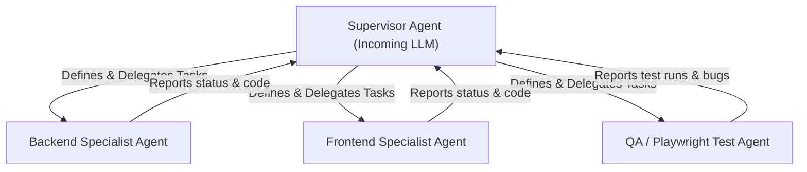

# Master Entrypoint — erxes AI Native Starter Skill

> **STOP. Read `.agents/SYSTEM-PROMPT.md` and `.agents/WORKFLOW.md` first. This is the absolute starting point for any incoming AI working on the erxes repo.**

This skill serves as the single orchestration center for incoming LLMs. Use this skill to initialize the context, understand the available tools, route wishes, rate task complexity, and boot the correct execution architecture.

---

# Master Skill Initialization

> **When to use:** Immediately upon starting a session or when receiving any user request/wish.

## Phase 1 — ROUTE & CLARIFY

### Step 1: List of Available Core Skills

Based on what the user wants, identify which plugin and specific skill playbook to trigger. Below is the directory map of pre-constructed gold-standard playbooks:

| Plugin Name | Plural Entity | Core Skills File Map |
|---|---|---|
| **sales** | `deals` | `skills/sales/` `add-deal-field.md`, `add-sales-automation.md`, `add-sales-graphql-query.md`, `add-sales-mutation.md`, `add-sales-segment-field.md`, `add-sales-trpc-procedure.md`, `add-sales-ui-page.md` |
| **frontline** | `tickets` | `skills/frontline/` `add-ticket-field.md`, `add-frontline-automation.md`, `add-frontline-graphql-query.md`, `add-frontline-mutation.md`, `add-frontline-segment-field.md`, `add-frontline-trpc-procedure.md`, `add-frontline-ui-page.md` |
| **operation** | `tasks` | `skills/operation/` `add-task-field.md`, `add-operation-automation.md`, `add-operation-graphql-query.md`, `add-operation-mutation.md`, `add-operation-segment-field.md`, `add-operation-trpc-procedure.md`, `add-operation-ui-page.md` |
| **payment** | `invoices` | `skills/payment/` `add-invoice-field.md`, `add-payment-automation.md`, `add-payment-graphql-query.md`, `add-payment-mutation.md`, `add-payment-segment-field.md`, `add-payment-trpc-procedure.md`, `add-payment-ui-page.md` |
| **accounting** | `accounts` | `skills/accounting/` `add-account-field.md`, `add-accounting-automation.md`, `add-accounting-graphql-query.md`, `add-accounting-mutation.md`, `add-accounting-segment-field.md`, `add-accounting-trpc-procedure.md`, `add-accounting-ui-page.md` |
| **loyalty** | `vouchers` | `skills/loyalty/` `add-voucher-field.md`, `add-loyalty-automation.md`, `add-loyalty-graphql-query.md`, `add-loyalty-mutation.md`, `add-loyalty-segment-field.md`, `add-loyalty-trpc-procedure.md`, `add-loyalty-ui-page.md` |
| **posclient** | `orders` | `skills/posclient/` `add-order-field.md`, `add-posclient-automation.md`, `add-posclient-graphql-query.md`, `add-posclient-mutation.md`, `add-posclient-segment-field.md`, `add-posclient-trpc-procedure.md`, `add-posclient-sync.md` |
| **content** | `cmsList` | `skills/content/` `add-cms-field.md`, `add-content-automation.md`, `add-content-graphql-query.md`, `add-content-mutation.md`, `add-content-segment-field.md`, `add-content-trpc-procedure.md`, `add-content-ui-page.md` |
| **mongolian** | `ebarimts` | `skills/mongolian/` `add-ebarimt-field.md`, `add-mongolian-automation.md`, `add-mongolian-graphql-query.md`, `add-mongolian-mutation.md`, `add-mongolian-segment-field.md`, `add-mongolian-trpc-procedure.md`, `add-mongolian-ui-page.md` |
| **insurance** | `contracts` | `skills/insurance/` `add-contract-field.md`, `add-insurance-automation.md`, `add-insurance-graphql-query.md`, `add-insurance-mutation.md`, `add-insurance-segment-field.md`, `add-insurance-trpc-procedure.md`, `add-insurance-ui-page.md` |
| **tourism** | `tours` | `skills/tourism/` `add-tour-field.md`, `add-tourism-automation.md`, `add-tourism-graphql-query.md`, `add-tourism-mutation.md`, `add-tourism-segment-field.md`, `add-tourism-trpc-procedure.md`, `add-tourism-ui-page.md` |

### Step 2: Confirming Logic

> [!IMPORTANT]
> You must clarify the developer's exact wish before proceeding. Ask a single clarifying or confirming question under **30 words**. 
> Stop and wait for the developer to confirm their intent.

---

## Phase 2 — CODEBASE ANALYSIS & SIZING

Once the developer confirms:
1. **Analyze the codebase first**: Use search tools to locate files related to the wish. Never write a plan on empty context.
2. **Rate the task complexity**: Assess the size of the required change:

| Complexity Rating | Criteria | Strategy |
|---|---|---|
| **Small** | Simple scalar field addition, typo fix, minor validation, single-file edit. | Proceed directly with single-caller simple atomic commits. |
| **Medium** | Simple GraphQL mutation, single UI form update, straightforward unit tests. | Standard 7-phase workflow without subagent orchestration. |
| **Large / Complex** | Multi-file changes spanning DB schema, GraphQL Federation, tRPC, React UI components, Webhooks, or Redis events. | **Orchestrate Hierarchical Centralized Orchestration (Supervisor Model)**. |

---

## Phase 3 — ORCHESTRATION BOOTSTRAP

If the complexity is rated **Large / Complex**, you must boot the Supervisor Model:

### Supervisor Model Architecture

#### 1. Define Subagents
Define the specialist subagents using the `define_subagent` tool:
* **Backend Specialist**: Equipped with write tools to edit schemas, @types, resolvers, and internal tRPC routes.
* **Frontend Specialist**: Equipped with write tools to edit Zod schemas, React routes, hooks, components, and module-federation exposes.
* **QA / Playwright Specialist**: Focused solely on writing and verifying Playwright tests in `.agents/plugins/<plugin>/tests/`.

#### 2. Supervisor (Orchestrator) Responsibilities
* Spawns subagents using `invoke_subagent`.
* Coordinates the plan step-by-step and merges code contributions.
* Sets one-shot timers (`schedule` tool) to resume checks without busy polling.
* Runs verification tests via `evals/run.sh <plugin> --include-e2e`.

---

## Slop checklist before routing

- [ ] Clarification question is strictly < 30 words.
- [ ] Codebase analysis was performed before establishing the plan.
- [ ] Task rating matches the criteria.
- [ ] Large tasks spawn explicit subagents to maintain clean context windows.
