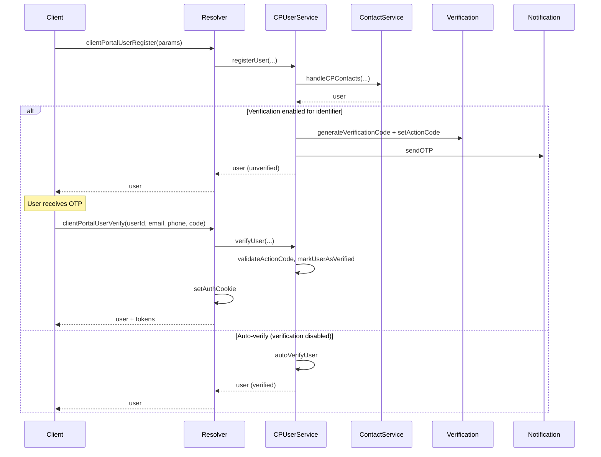
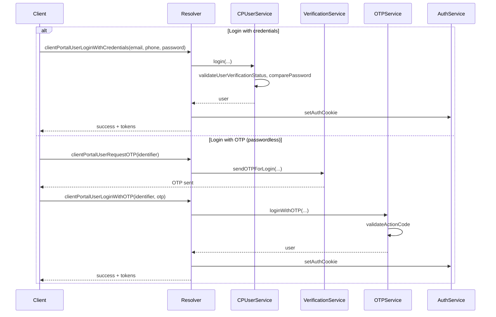
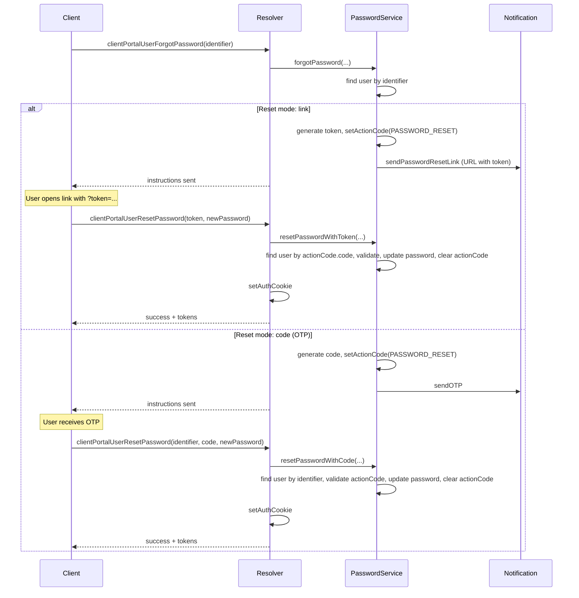
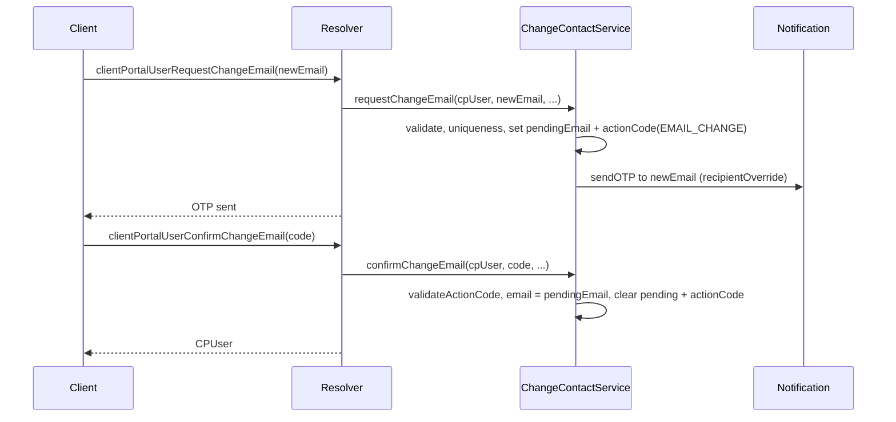

# Client Portal Authentication Flows

This document describes how registration, login, forgot password, and reset password work in the client portal. It is the single reference for understanding the end-to-end process.

## Overview

- **Registration**: User registers (email/phone, optional password) → optionally verifies with OTP → can log in (cookie set on verify or after auto-verify).
- **Login**: Either **credentials** (email/phone + password) or **passwordless OTP** (request OTP → submit OTP).
- **Forgot password**: User submits identifier → backend sends either a reset **link** (token in URL) or a **code** (OTP) depending on portal config.
- **Reset password**: With **link**: call reset with `token` from URL. With **code**: call reset with `identifier` + `code` (the received OTP).
- **Change email / Change phone**: Authenticated user requests change with new email or phone → OTP is sent to the new value → user confirms with code → email/phone and verification flags are updated.

The CP user document has a single field **actionCode**: `{ code, expires, type }`. It is used for:

- Registration verification (types: `EMAIL_VERIFICATION`, `PHONE_VERIFICATION`)
- Passwordless login OTP (same types; code is validated then user is logged in)
- Password reset (type: `PASSWORD_RESET`; `code` holds either a link token or a numeric OTP depending on config)
- Change email (type: `EMAIL_CHANGE`) and change phone (type: `PHONE_CHANGE`): OTP sent to the new value; user document also has optional `pendingEmail` / `pendingPhone` until confirmation.

---

## Flow Diagrams

### Registration and Verify

### Login (Credentials vs OTP)

### Forgot Password and Reset

### Change email / Change phone

Requires an authenticated client portal user (cookie). OTP is sent to the **new** email or phone; the same rate limits as login OTP apply.

Same pattern for phone: `clientPortalUserRequestChangePhone(newPhone)` then `clientPortalUserConfirmChangePhone(code)`.

---

## API Summary

| Flow | Mutation / usage |
|------|-------------------|
| Register | `clientPortalUserRegister({ email?, phone?, password?, ... })` |
| Verify | `clientPortalUserVerify({ userId, email, phone, code })` — sets cookie on success |
| Login (credentials) | `clientPortalUserLoginWithCredentials({ email, phone, password })` |
| Request OTP for login | `clientPortalUserRequestOTP({ identifier })` |
| Login with OTP | `clientPortalUserLoginWithOTP({ identifier, otp })` |
| Forgot password | `clientPortalUserForgotPassword({ identifier })` — backend chooses link or code from portal config |
| Reset (link) | `clientPortalUserResetPassword({ token, newPassword })` — token from reset URL |
| Reset (code) | `clientPortalUserResetPassword({ identifier, code, newPassword })` — code is the OTP received |
| Request change email | `clientPortalUserRequestChangeEmail({ newEmail })` — requires auth; OTP sent to new email |
| Confirm change email | `clientPortalUserConfirmChangeEmail({ code })` — requires auth |
| Request change phone | `clientPortalUserRequestChangePhone({ newPhone })` — requires auth; OTP sent to new phone |
| Confirm change phone | `clientPortalUserConfirmChangePhone({ code })` — requires auth |

---

## actionCode Types

| type | Used in | Meaning |
|------|--------|--------|
| `EMAIL_VERIFICATION` | Registration, passwordless login (email) | OTP sent to email |
| `PHONE_VERIFICATION` | Registration, passwordless login (phone) | OTP sent to phone |
| `PASSWORD_RESET` | Forgot password (link or code) | Reset link token or OTP code stored in `actionCode.code` |
| `EMAIL_CHANGE` | Change email (authenticated) | OTP sent to new email; `pendingEmail` set until confirm |
| `PHONE_CHANGE` | Change phone (authenticated) | OTP sent to new phone; `pendingPhone` set until confirm |

Validation always checks: presence of actionCode, correct type, not expired, and code/token match.
