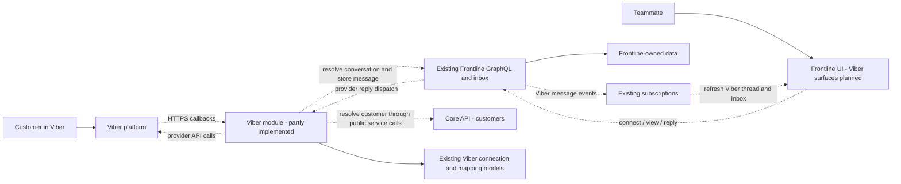
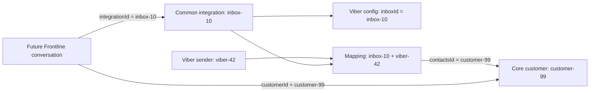
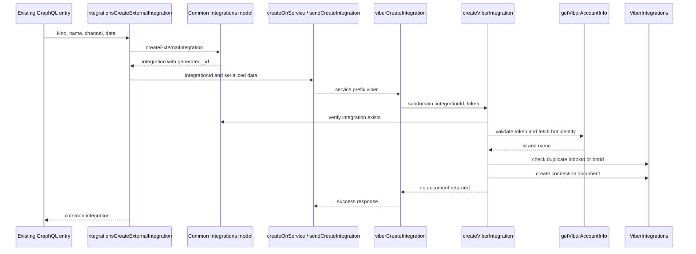
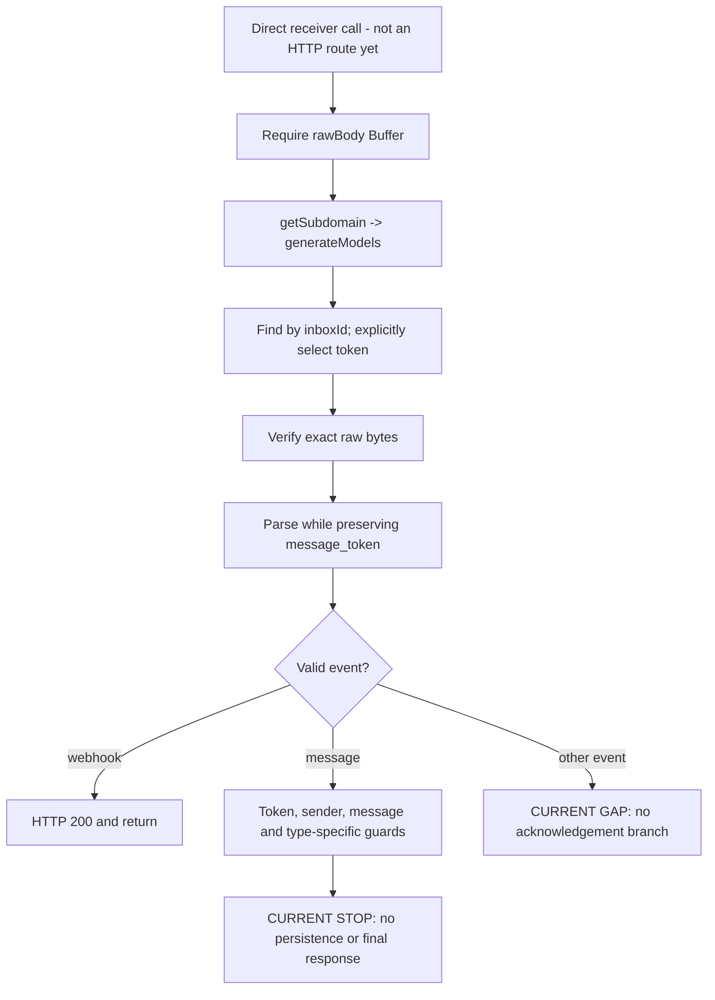
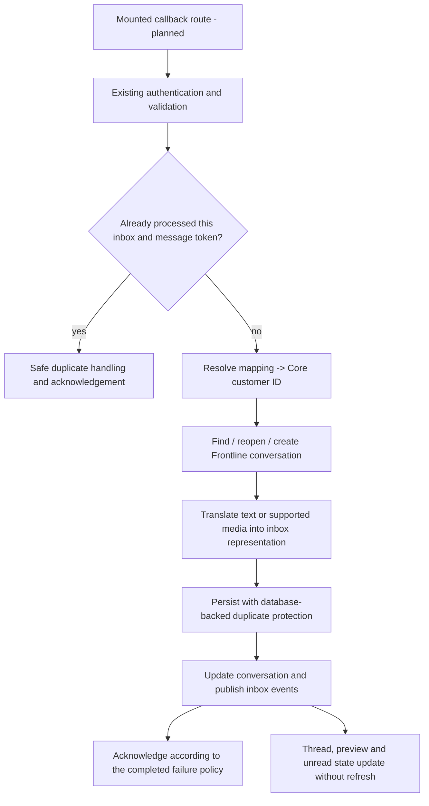

# Frontline + Viber: learning guide and integration roadmap

Verified against the working tree on **2026-09-14**, branch
`feat/frontline-viber-integration`, including the customer-resolution helper and
its saved tests. The commit IDs below are historical reading landmarks.

This is our reference for understanding the work, not a claim that the integration
is finished. It separates existing code from proposed behavior. Read one section
at a time; you do not need to understand the whole monorepo before taking the next
step.

The intended outcome: a teammate connects a Viber bot to a Frontline inbox, a
customer sends a message, the right conversation appears, and the teammate replies
from Frontline. Connection problems, unsupported messages, and send failures must
be understandable, not silent.

## Contents

1. [Where we are now](#where-we-are-now)
2. [Who owns what](#who-owns-what)
3. [The IDs and records](#the-ids-and-records)
4. [Our Viber files](#our-viber-files)
5. [Connecting a bot: current call chain](#connecting-a-bot-current-call-chain)
6. [Models, tenants, and all those arrows](#models-tenants-and-all-those-arrows)
7. [Receiving a callback: current call chain](#receiving-a-callback-current-call-chain)
8. [Customer resolution: the next bridge](#customer-resolution-the-next-bridge)
9. [The complete inbound path we are aiming for](#the-complete-inbound-path-we-are-aiming-for)
10. [Replies and delivery state](#replies-and-delivery-state)
11. [Connecting for real: token, webhook, and ngrok](#connecting-for-real-token-webhook-and-ngrok)
12. [Disconnecting and reconnecting](#disconnecting-and-reconnecting)
13. [The Frontline functions we will reuse](#the-frontline-functions-we-will-reuse)
14. [The frontend is part of the integration](#the-frontend-is-part-of-the-integration)
15. [Small-step roadmap](#small-step-roadmap)
16. [Testing and validation](#testing-and-validation)
17. [Troubleshooting and tiny lessons](#troubleshooting-and-tiny-lessons)
18. [Decisions for the lead](#decisions-for-the-lead)
19. [Keeping this guide useful](#keeping-this-guide-useful)

Mermaid diagrams render in compatible Markdown previews. Each diagram also has a
prose explanation, so the guide still works in a plain text editor.

## Where we are now

**We have backend groundwork, not a working end-to-end Viber channel yet.**

| Area                       | Current implementation                                                        | What that does not prove                                                         |
| -------------------------- | ----------------------------------------------------------------------------- | -------------------------------------------------------------------------------- |
| Callback authentication    | Exact-body HMAC verification with saved tests                                 | A real Viber callback has reached this application                               |
| Bot account lookup         | Validated, timeout-bounded `get_account_info` request with mocked HTTP tests  | We have a usable bot or have tested its credentials live                         |
| Connection records         | Viber model, creation helper, adapter, and common creation dispatcher         | A webhook is registered or the inbox is ready to receive                         |
| Removal                    | Common removal flow calls Viber record cleanup first                          | Remote webhook removal, history cleanup, or reconnect behavior exists            |
| JSON precision             | Raw-body parser preserves `message_token` as an exact string                  | Message deduplication or delivery tracking exists                                |
| Receiver                   | Signature, envelope, sender, and type-specific validation                     | The receiver is mounted, saves messages, or responds on every path               |
| Customer mapping           | Registered model and tested helper to reuse mappings or create Core customers | The receiver calls it, or Core creation and mapping persistence are atomic       |
| Conversations and messages | Existing Frontline infrastructure is available                                | Viber currently creates or retrieves its conversations/messages                  |
| Replies                    | Existing Frontline reply dispatcher is available                              | It has a Viber branch; it does not yet                                           |
| Frontend                   | Existing integration and inbox UI patterns are available                      | There is a Viber catalog entry, connection form, thread view, or reply UI wiring |

There are **67 saved Viber tests** at this checkpoint. They cover utilities,
early receiver validation, the mapping schema, and isolated customer resolution,
not the whole integration. See [testing](#testing-and-validation) for the exact
boundary.

No usable bot/token has been supplied for live verification. That blocks the real
provider smoke test, but not the next local development slices.

Useful Git landmarks, in implementation order:

| Commit       | Why it matters                                                                       |
| ------------ | ------------------------------------------------------------------------------------ |
| `8fada59e85` | Create a provider record only after checking the inbox, bot identity, and duplicates |
| `6855b3c4cc` | Adapt common integration input into the Viber helper contract                        |
| `fccaf31f32` | Reach the adapter from common integration creation                                   |
| `f7a21fa6b9` | Reach provider cleanup from common integration removal                               |
| `a287d6ed4e` | Reject padded credentials instead of silently trimming them                          |
| `28beb34514` | Preserve large message IDs before JavaScript rounding loses information              |
| `24696588e3` | Save receiver boundary regression tests                                              |
| `0bc1e28750` | Register and test the Viber-to-Core customer mapping schema                          |

These landmarks explain dependency order, not a percentage-complete estimate.

## Who owns what

Think of Viber as a new input/output adapter for Frontline, not a second inbox
application inside the inbox application.

| Component                   | Responsibility                                                                                          | Not its responsibility                                                |
| --------------------------- | ------------------------------------------------------------------------------------------------------- | --------------------------------------------------------------------- |
| Viber                       | External bot identity, provider messages, callbacks                                                     | Our Core customer IDs or Frontline conversation rules                 |
| Frontline UI                | Connection forms, conversation display, composing replies, feedback                                     | Holding the bot token for routine messaging or calling Viber directly |
| Frontline common inbox code | Integrations, channels, conversations, shared messages, inbox subscriptions                             | Knowing every provider's payload format                               |
| Frontline Viber module      | Provider authentication, payload validation/translation, identity mapping, provider-specific operations | Reimplementing Core contacts or generic inbox infrastructure          |
| Core API                    | The shared customer/contact record                                                                      | Owning our private Viber mapping collection                           |
| Shared backend utilities    | Existing service calls, tenant-model setup, server bootstrap, pub/sub                                   | Feature-specific Viber business rules                                 |

The following is the **target architecture**. Dashed edges are Viber work still
to be completed; they are not an assertion that the calls already exist.



The integration's source scope is the paired `frontline_api` and `frontline_ui`
projects. Reading Core or shared code to understand a contract is fine. Changing
those projects to make Viber work is a separate, explicitly approved task.

## The IDs and records

This is the most useful section to return to when a variable name feels vague.

### One fictional customer

Imagine Mina messages the bot connected to our support inbox:

| Record or field                  | Fictional value                   | Meaning                                                |
| -------------------------------- | --------------------------------- | ------------------------------------------------------ |
| Request `subdomain`              | `acme`                            | Which organization/request context we are working in   |
| Common `Integrations._id`        | `inbox-10`                        | Frontline's integration record                         |
| Common integration `channelId`   | `channel-3`                       | The Frontline channel containing that integration      |
| `ViberIntegrations._id`          | `viber-config-2`                  | The provider configuration document's own ID           |
| `ViberIntegrations.inboxId`      | `inbox-10`                        | Link back to the common integration                    |
| `ViberIntegrations.botId`        | `bot-8`                           | Bot identity returned by account lookup                |
| Callback `sender.id`             | `viber-42`                        | Mina's external Viber identity                         |
| `ViberCustomers._id`             | `map-7`                           | The mapping document's own ID                          |
| `ViberCustomers.userId`          | `viber-42`                        | The external sender this mapping describes             |
| `ViberCustomers.contactsId`      | `customer-99`                     | Mina's Core customer ID                                |
| Future conversation `customerId` | `customer-99`                     | Reference to the same Core customer                    |
| Future conversation `_id`        | `conversation-5`                  | One Frontline conversation, not the customer           |
| Callback `message_token`         | `4912661846655238145` as a string | External message identity, not our database message ID |

`inboxId` is an unfortunate opportunity for confusion: **in these Viber schemas,
it means the common integration ID, not the channel ID**.

Likewise, Viber mapping `userId` means an external sender; the generic inbox also
uses `userId` for staff in other contexts. Read the owning type, not just the name.



### Why a mapping, rather than copying the customer?

The mapping answers: “For this inbox and this Viber sender, which Core customer
should Frontline use?” It is a small reference record, not a second complete
contact profile.

The lookup key is **`inboxId + userId`**. The answer is **`contactsId`**.

- Inbox alone is insufficient: many people message one inbox.
- Sender alone ignores our chosen inbox-scoped identity contract.
- The mapping's `_id` identifies the link, not the person.
- A display name is not a safe identity key; two people can be named Mina.
- A mapping miss does not prove that no matching Core contact exists. That is a
  separate identity/reuse policy decision.

The [customer schema](../src/modules/integrations/viber/db/definitions/customers.ts)
declares a compound unique index on `{ inboxId: 1, userId: 1 }`. This permits many
senders per inbox and separate mappings across inboxes, but not two mappings for
the same pair within the model's database. It does **not** make `contactsId`
unique or automatically merge people across channels.

The tests inspect this index declaration. They do not demonstrate that a running
MongoDB instance has created or enforced the index.

## Our Viber files

These links point to current files, not proposed names:

| File                                                                                               | Job                                                                                    |
| -------------------------------------------------------------------------------------------------- | -------------------------------------------------------------------------------------- |
| [utils/signature.ts](../src/modules/integrations/viber/utils/signature.ts)                         | Authenticate the exact callback bytes                                                  |
| [utils/account.ts](../src/modules/integrations/viber/utils/account.ts)                             | Validate a token and fetch a small, validated bot identity                             |
| [utils/webhook.ts](../src/modules/integrations/viber/utils/webhook.ts)                             | Parse raw JSON without rounding numeric message tokens                                 |
| [helpers.ts](../src/modules/integrations/viber/helpers.ts)                                         | Create/delete connections and resolve Core customers through tenant-scoped mappings    |
| [messageBroker.ts](../src/modules/integrations/viber/messageBroker.ts)                             | Translate common integration input/error conventions into helper calls                 |
| [controller/receiveMessage.ts](../src/modules/integrations/viber/controller/receiveMessage.ts)     | Unmounted receiver; currently validates callbacks                                      |
| [@types/account.ts](../src/modules/integrations/viber/@types/account.ts)                           | The small account-info return shape                                                    |
| [@types/integration.ts](../src/modules/integrations/viber/@types/integration.ts)                   | Connection document types                                                              |
| [@types/customer.ts](../src/modules/integrations/viber/@types/customer.ts)                         | Mapping document types                                                                 |
| [@types/webhook.ts](../src/modules/integrations/viber/@types/webhook.ts)                           | Express request type with raw body and route parameter                                 |
| [db/definitions/integrations.ts](../src/modules/integrations/viber/db/definitions/integrations.ts) | Connection fields, generated string ID, unique inbox/bot keys, hidden-by-default token |
| [db/definitions/customers.ts](../src/modules/integrations/viber/db/definitions/customers.ts)       | Mapping fields and compound index                                                      |
| [db/models/Integrations.ts](../src/modules/integrations/viber/db/models/Integrations.ts)           | Typed Mongoose model and schema loader                                                 |
| [db/models/Customers.ts](../src/modules/integrations/viber/db/models/Customers.ts)                 | Typed mapping model and schema loader; resolution logic lives in `helpers.ts`          |
| [connectionResolvers.ts](../src/connectionResolvers.ts)                                            | Registers both Viber models in Frontline's model container                             |

`@types` describes what TypeScript expects. A Mongoose schema defines stored fields
and database-model behavior. A model is the object used to query/create documents.
None of these, by themselves, validates arbitrary HTTP JSON or creates a Core
customer.

## Connecting a bot: current call chain

Entry point: the existing
[integrations mutation resolver](../src/modules/inbox/graphql/resolvers/mutations/integrations.ts).
There is no Viber form yet, but its common server-side dispatch has a Viber case.



Step by step:

1. The resolver establishes the common integration's channel. It checks an
   explicitly supplied channel and rejects another user's personal channel; when
   absent, it gets or creates the current user's personal channel.
2. The common model creates the integration. **This is where the `integrationId`
   comes from.** The browser does not need to invent a second ID for our helper.
3. `createOnService` calls `sendCreateIntegration`. The service name comes from
   `kind.split('-')[0]`. Our case is `viber`; the final complete kind value still
   needs to be aligned with the future UI and reply action.
4. `viberCreateIntegration` parses the serialized settings, checks the object and
   token shape, and calls the helper.
5. `createViberIntegration` checks the common record, asks Viber for the bot
   identity, rejects an already-used inbox or bot, then saves the provider record.
6. The helper returns `Promise<void>`. The flow does not need the secret-bearing
   document as its result.

The two similarly named functions are deliberate layers:

- **`viberCreateIntegration`** is the adapter: common input shape and response
  convention.
- **`createViberIntegration`** is the business helper: a direct operation on three
  explicit inputs.

`messageBroker.ts` follows the local provider naming pattern. In this Viber path,
it contains ordinary in-process function calls; its filename does not mean a
message is queued in Redis or delivered by a background worker.

### Where errors go

The creation adapter uses
[withErrorHandling](../src/shared/utils.ts), which catches a rejected helper call
and returns the common `{ status: 'error', errorMessage }` shape. `createOnService`
recognizes that shape, removes the newly created common integration, and rethrows.
The GraphQL caller receives a failed operation. The existing frontend
[useIntegrationAdd](../../../../frontend/plugins/frontline_ui/src/modules/integrations/hooks/useIntegrationAdd.tsx)
already has success/error toast handling for that mutation.

This explains why `await getViberAccountInfo(...)` does not need its own local
`try/catch` in the helper: that function cannot recover from invalid credentials,
and its caller already owns reporting the failure.

There are limits to this safety:

- This cleanup is **compensation**, not a transaction covering Core, MongoDB,
  Viber, and every later action.
- An existence check improves the error message; it does not eliminate concurrent
  creation races. Database uniqueness remains important.
- Once webhook registration is added, partial local/remote success needs its own
  explicit cleanup/readiness policy.
- This resolver currently uses `markResolvers(..., { wrapperConfig:
{ skipPermission: true } })`. Channel checks are visible, but we must verify the
  complete authentication/authorization path before shipping a token-management
  UI. Being an existing resolver is not proof that every needed permission is
  enforced.

## Models, tenants, and all those arrows

In [connectionResolvers.ts](../src/connectionResolvers.ts):

```typescript
export const generateModels = createGenerateModels<IModels>(loadClasses);
```

Read this as two separate moments:

1. **Setup:** give the shared factory Frontline's `loadClasses` function. Receive
   a new function and name it `generateModels`.
2. **Request handling:** call `await generateModels(subdomain)` to get the
   appropriate model container, such as `models.ViberCustomers`.

In shorthand: `factory(loader) -> function(subdomain) -> Promise<models>`.
The arrows describe functions returning functions, not three requests being sent.
`<IModels>` is the TypeScript description of the returned container; it does not
create a database at runtime.

The shared [createGenerateModels implementation](../../../erxes-api-shared/src/utils/mongo/generate-models.ts)
has two deployment paths:

- In the non-SaaS path, it uses the configured Mongoose connection.
- In SaaS, it resolves the organization from the subdomain, obtains its database
  with `useDb`, and uses cached connections.
- In both paths, it prepares scoped event handlers and passes the connection,
  subdomain, and handlers to our `loadClasses` function.

So “generate models” does not mean “open a brand-new database connection and copy
all the data for every message.” It means assemble/access the model API for the
appropriate deployment and request context.

`loadClasses` registers:

- `models.ViberIntegrations` against `viber_integrations`.
- `models.ViberCustomers` against `viber_customers`.

The Viber loaders currently return schemas. A `load...Class` name does not mean a
custom class already exists. Mail's customer loader actually attaches class
methods; our customer loader currently does not.

### Where does `subdomain` come from?

For the receiver, it comes from the shared
[getSubdomain(req)](../../../erxes-api-shared/src/utils/utils.ts). The current
implementation selects `nginx-hostname`, then the `hostname` header, then
`req.hostname`, and takes the first hostname segment. For GraphQL, the platform
supplies the subdomain/context to Frontline's
[bootstrap](../src/main.ts), which populates `context.models`.

Deployment/proxy routing therefore matters. A random tunnel hostname is not
automatically the intended SaaS tenant. We must test the approved proxy/hostname
mapping; do not fix a mismatch by hardcoding a tenant in Viber code or trusting a
tenant field in the callback JSON.

## Receiving a callback: current call chain

Source: [receiveViberMessage](../src/modules/integrations/viber/controller/receiveMessage.ts).

**This function is not mounted in [routes.ts](../src/routes.ts).** Calling a
plausible `/viber/...` URL will not reach it today.



Failures at the relevant guards return early with `400`, `401`, or `404`.
Infrastructure failures can still reject: there is no completed outer HTTP error
boundary in this receiver yet. Valid messages and other event names currently
reach the end without sending a response. It must not be exposed as a finished
webhook handler in this state.

### Why raw bytes first?

The existing shared
[server bootstrap](../../../erxes-api-shared/src/utils/start-plugin.ts) already
captures JSON request bytes into `req.rawBody` in the `express.json` verify
callback, before mounting the plugin router. We did not need to change shared
middleware to obtain them.

The shared JSON parser also populates `req.body`. Our receiver deliberately does
not trust that parsed value for message-token precision. Inside the receiver, the
order is **authenticate raw bytes, then parse those same bytes, then validate**.
This does not mean Express has done no parsing before the handler runs: malformed
JSON may be rejected by middleware before reaching it. A direct controller unit
test does not exercise that middleware behavior.

### Tiny lesson: HMAC and `timingSafeEqual`

Our [signature utility](../src/modules/integrations/viber/utils/signature.ts)
calculates a secret-keyed SHA-256 digest from the token and the exact bytes. The
received header is validated as 64 hexadecimal characters, decoded to 32 bytes,
then compared with the calculated 32-byte digest using `timingSafeEqual`.

The format check matters because `timingSafeEqual` expects equal byte lengths.
The special comparison avoids the ordinary early-exit byte-comparison behavior.
This is authentication/integrity checking, **not encryption**, and it is not
protection against replaying an otherwise valid callback.

Parsing and serializing JSON again can change whitespace or number formatting.
Even if the resulting object means the same thing, its bytes need not be the
signed bytes. That is why `JSON.stringify(req.body)` is not a substitute.

### Tiny lesson: the JSON reviver

Ordinary JavaScript numbers cannot represent every large integer exactly:

```text
Original JSON number: 4912661846655238145
Ordinary parsed value: 4912661846655238000
String of that value: "4912661846655238000"  <- already too late
Our preserved token:  "4912661846655238145"
```

A **reviver** is the callback supplied as the second argument to `JSON.parse`.
Our [parser](../src/modules/integrations/viber/utils/webhook.ts) uses the primitive
value's `context.source` to recover the original numeric text when the key is
`message_token`. It returns that text as a string. Other values stay unchanged.

It returns `unknown`, because parsing JSON proves only that it is JSON, not that
it is a valid Viber message. The receiver subsequently requires a decimal-string
token. The parser throws rather than accepting rounded IDs if source text is not
available. Test this on the deployment Node version as well as locally.

### What the type-specific guards currently check

These are **validation rules in code**, not an end-to-end support matrix:

| Type                              | Current checks after common token/sender/message validation                            |
| --------------------------------- | -------------------------------------------------------------------------------------- |
| `text`                            | Nonblank string `text`                                                                 |
| `picture`, `video`, `url`, `file` | Nonblank `media`, parseable URL, `http:` or `https:` protocol                          |
| `file`                            | Additionally nonblank `file_name`; `file_size` is a safe integer from 0 through 25 MiB |
| `location`                        | Finite latitude from -90 to 90 and longitude from -180 to 180                          |
| `contact`                         | Nonblank phone number; optional name must be a string no longer than 128 characters    |
| `sticker`                         | Safe-integer `sticker_id`                                                              |

25 MiB means `25 * 1024 * 1024` bytes. It is our current declared-size guard,
not a verified universal Viber media limit. It does not inspect downloaded bytes;
no Viber download implementation exists yet.

Likewise, allowing an HTTP(S) URL checks syntax/protocol, not destination or
redirect safety. If we later fetch remote media, actual byte limits, timeouts,
content validation, and safe destinations need separate handling.

## Customer resolution: the next bridge

At this checkpoint, `getOrCreateViberCustomer` implements the following contract
as an internal helper, but the receiver does not call it yet:

> Given a validated sender and an inbox in this tenant, return the correct Core
> customer ID, or fail clearly.

For a returning sender, the helper looks up both identity fields:

```typescript
const selector = { inboxId, userId };
const existingMapping = await models.ViberCustomers.findOne(selector);
```

`{ inboxId, userId }` is shorthand for `{ inboxId: inboxId, userId: userId }`.
These values are helper parameters; the future receiver will supply them from
the selected integration and validated sender. Both conditions must match.
`findOne` resolves to a document or `null`; a database failure rejects the promise
instead of resolving to `null`.

If we find the fictional `map-7`, the caller needs its `contactsId`, which is
`customer-99`. Returning `map-7` would give the conversation a reference to the
wrong collection. TypeScript cannot distinguish these IDs automatically because
both are strings. Tests should deliberately use different strings for every ID.

A `return` inside the customer helper ends that helper. Once wired, it will not
end the whole receiver: the receiver will await the returned ID and continue to
conversation processing.

### What happens when no mapping exists?

The helper now implements this flow:

1. Call Core's public `customers.createCustomer` mutation with
   `doc.integrationId: inboxId` and an optional, trimmed display `firstName`.
2. Treat the response as `unknown`; require a non-array object with a non-blank
   string `_id` before any mapping write.
3. Await saving the mapping with `inboxId`, external `userId`, and Core
   `contactsId`.
4. Return the stored Core ID.

There is no automatic matching to an existing Core person by name or email in
this helper. Do not invent an email address to make an email-specific helper fit.
A missing optional name/avatar must not become a different identity. The future
receiver must check optional profile values before passing them to a typed
helper; a TypeScript parameter does not validate arbitrary webhook JSON.
Cross-channel merging and recovery from stale mappings are separate decisions.

The useful reference is
[MailCustomers.findOrCreate](../src/modules/integrations/mail/db/models/Customers.ts):
it checks its mapping, uses `sendTRPCMessage` for Core customer lookup/creation,
upserts its provider mapping, and returns `contactsId`. Its identity key is email;
we should reuse the responsibility split, **not copy that key**.

`sendTRPCMessage` is the existing service-to-service interface. It lets Frontline
ask Core to perform customer work without importing Core's private models. This
helper carries the same subdomain and sets `throwOnError: true` so service
failures reject. Response validation is still necessary: a resolved value is not
automatically a valid customer. Do not turn a Core failure into a fabricated
customer ID or a successful webhook response.

### Why the unique index is not the entire concurrency solution

Two first messages can arrive together and both see no mapping. The compound
index can stop two mapping rows, once installed. It cannot undo two Core customer
creations that happened before either mapping was saved.

The helper catches a mapping-save error with numeric `code === 11000` and queries
the same inbox/user pair again. If another request saved the mapping first, both
callers can use that winner's `contactsId`. Without a matching row, the original
write error rejects; other failures are not treated as duplicates.

The saved tests cover this recovery, including a deterministic concurrent-call
case: both callers return the winning mapping's Core ID, but **two mocked Core
creations still happen**. This test records a limitation, not an exactly-once
guarantee. A mapping failure after successful Core creation can also leave an
unmapped customer, and a retry can create another.

Before exposing live callbacks, resolve this cross-service failure policy with
the lead and the available Core contract. Do not silently delete Core customers
as compensation or introduce a queue/locking service as an incidental Viber
refactor. The helper remains unwired while these boundaries are being completed.

## The complete inbound path we are aiming for

The end-to-end wiring after validation below is **planned Viber behavior**, using
existing Frontline capabilities where appropriate. Customer resolution now
exists as an isolated helper, not as a completed step in a running callback.



### The conversation is a different decision from the customer

Resolving Mina to `customer-99` does not tell us whether to reuse
`conversation-5`. A person can have several conversations.

We need a policy for the same inbox/customer pair: reuse an open conversation,
reopen a resolved one, or create a new one under specified conditions. This is a
product rule, not something `findOne` decides for us.

The existing [receiveInboxMessage](../src/modules/inbox/receiveMessage.ts) helper
has a `create-or-update-conversation` action. It can update a conversation whose
ID is supplied, or create one. **It does not automatically discover the correct
conversation for a Viber sender.** The Viber layer must resolve that first and
check the helper's success/error result.

Mail demonstrates this division in
[resolveConversationId and storeInboundMessage](../src/modules/integrations/mail/controller/receiveMessage.ts):
customer resolution, email-specific thread lookup, common conversation work,
provider message storage, then publishing. Email subjects/reply headers are not
Viber conversation keys.

### Decide message storage before wiring the UI

There is no `ViberMessages` model today. Do not assume we have already decided to
add one.

| Option to evaluate                                                        | Advantage                                                                           | Required follow-through                                                                                               |
| ------------------------------------------------------------------------- | ----------------------------------------------------------------------------------- | --------------------------------------------------------------------------------------------------------------------- |
| Common `ConversationMessages`, with appropriate provider metadata/mapping | Reuse common message queries, rendering and subscriptions where their contracts fit | Establish exact-token storage, uniqueness, provider status and safe content representation within Frontline           |
| Provider-owned messages linked to common conversations, as Mail does      | Provider fields have a clear home                                                   | Own the message query/resolvers, conversion, rendering and realtime behavior; avoid duplicate common/provider bubbles |

Our preference is the smallest repo-native design that meets the actual data
contract. The decision is still open. A successful database insert is not enough
if the selected GraphQL query cannot read that record.

### Deduplication and acknowledgement

An initial lookup can avoid unnecessary work, but two callbacks can both miss it.
The final storage design needs database-backed uniqueness or an equivalent atomic
operation scoped to the inbox and exact external message token. Do not convert
that token back to a number.

Authentication answers “is this callback authentic?” Deduplication answers “have
we already processed it?” Those are different questions.

For the first slice, aim for straightforward awaited processing, not a new
background-processing system. Before mounting, define what happens when:

- Core or MongoDB fails before persistence.
- A message is persisted but event publication fails.
- The provider retries while the first request is still running.
- An authentic callback type is intentionally ignored.
- A valid but not-yet-renderable message type arrives.

Do not acknowledge a message as handled and then rely on untracked work that can
vanish. Conversely, a retry after partial success must not duplicate the customer,
conversation, message, or visible notification. Test these boundaries; neither
“always return 200” nor “always throw” is a complete policy.

## Replies and delivery state

The existing common outgoing chain is:

```text
MessageInput
  -> useConversationMessageAdd
  -> GraphQL conversationMessageAdd
  -> load conversation and its integration
  -> internal note? store locally; do not dispatch to provider
  -> otherwise dispatchConversationToService
  -> provider adapter
  -> result handling / common message storage / publication
```

Sources: [MessageInput](../../../../frontend/plugins/frontline_ui/src/modules/inbox/conversations/conversation-detail/components/MessageInput.tsx),
[useConversationMessageAdd](../../../../frontend/plugins/frontline_ui/src/modules/inbox/conversations/conversation-detail/hooks/useConversationMessageAdd.tsx),
[conversationMessageAdd and dispatcher](../src/modules/inbox/graphql/resolvers/mutations/conversations.ts).

**There is currently no Viber case in `dispatchConversationToService`.** Adding
the creation dispatcher did not add the reply dispatcher. A Viber external reply
through this path would currently be rejected as an unsupported service.

Our proposed outgoing responsibilities:

1. Keep existing conversation/channel authorization and the internal-note split.
2. Resolve the correct Viber recipient from this conversation's identity context.
   A Core customer ID is not an external `receiver` ID. Also, `contactsId` is not
   unique in our mapping schema; do not assume an inverse lookup can safely pick
   an arbitrary matching Viber user.
3. Load the token on the backend only. Validate content and attachment limits.
4. Convert the editor's representation into the provider-supported payload. The
   generic editor can produce HTML; that is not automatically appropriate Viber
   text. Define conversion and unsupported-content behavior explicitly.
5. Make a bounded provider request and validate its response. Preserve returned
   message identifiers exactly, including any large numeric tokens.
6. Return the exact contract expected by the common mutation, or deliberately
   adopt a provider-specific path if storage requires it. The current mutation
   examines `response.status` and nested `response.data.data`; do not guess.
7. Persist/publish once and show failures in the UI. A toast is not proof the
   recipient received the message.

Accepted, delivered, seen, and failed are different states. Receipt handling is a
future callback path, not another incoming chat bubble. It will need to correlate
the external token with the stored outgoing message and handle repeated or
out-of-order updates without regressing state.

A network timeout is ambiguous: the provider might have accepted the request
before the connection failed. Blindly retrying an outbound send can create two
messages. We must decide how to represent an uncertain send and offer recovery.

## Connecting for real: token, webhook, and ngrok

### Provider constraints to recheck before live testing

A usable bot and token are required. Registering a webhook uses `set_webhook`
with a trusted HTTPS URL and a successful availability callback. Normal sends use
`send_message` for subscribed recipients; a first inbound message can subscribe
someone without a separate subscription callback. Viber retries callbacks until
it receives HTTP 200. Delivery/read callbacks can repeat. Removing the remote
webhook uses `set_webhook` with an empty URL. These constraints inform the planned
registration, retry, and receipt handling; they are not implemented merely by
being listed here. [Viber Bot REST API](https://developers.viber.com/docs/api/rest-bot-api/)

### Token: configurable does not mean stored in the browser

The current backend contract accepts a token in integration settings, validates
it, and stores it in the tenant's `viber_integrations` document. That supports a
future connection form and multiple tenant-owned configurations without a single
global `VIBER_TOKEN` environment variable. The bot token is a secret credential;
the similarly named `message_token` is a message identifier, not that credential.

The future intended flow is:

```text
Authorized connection form -> backend validation -> tenant-owned secret storage
                                                   |
                                  backend reads it for provider operations
```

The form does not exist yet. Do not add the token to frontend configuration,
routine GraphQL responses, browser persistence, URLs, logs, or this guide.

The current schema uses `select: false`: ordinary queries omit the field, and the
receiver opts in with `.select('+token')`. **That is projection, not encryption.**
The application currently saves the token as a string. Production secret storage,
database/backup access, rotation, and redaction need a deliberate review with the
lead; do not invent a home-grown encryption scheme for this slice.

Calling `token.trim()` to compare or validate produces a separate string; it does
not mutate the original. Our account helper rejects `token !== token.trim()` and
sends an accepted token unchanged. That is different from assigning
`token = token.trim()` and silently changing a credential.

### Registration order matters

Proposed sequence, not a completed workflow:

1. Validate the settings and credentials.
2. Create the common/provider records needed for callback lookup.
3. Ensure the completed callback route is publicly reachable with the correct
   tenant context and raw bytes.
4. Request remote webhook registration.
5. Let the availability callback find the saved provider record and validate its
   signature.
6. Validate the registration response and report an accurate ready/failure state.

The local record must be available when the callback arrives. Registration must
not depend on a record that only gets saved after registration returns. Conversely,
a saved record with failed registration must not appear fully connected. We need
to choose repairable failed state versus compensating cleanup before adding this
step to creation.

No webhook URL, registration helper, or connection-state schema is being declared
as implemented by this plan.

### When ngrok becomes useful

ngrok can expose a local HTTP service at a public URL.
[Official ngrok introduction](https://ngrok.com/docs/start)

In our local test setup, that means routing the approved public callback address
to the running Frontline API. The default port in [main.ts](../src/main.ts) is
`3304`, but the shared bootstrap permits a `PORT` override. Check the actual
running service before configuring a tunnel.

It becomes useful once the route, complete response behavior, and registration
flow exist and a bot/token is available. It is not needed for offline unit tests.

Before exposing anything, verify the route, proxy/tenant mapping, secret handling,
and tunnel access scope. A tunnel does not validate signatures, preserve IDs,
create customers, or fix a hanging receiver. Do not use production credentials or
leave unrelated development endpoints publicly exposed as a shortcut.

## Disconnecting and reconnecting

The current local removal chain is:

```text
integrationsRemove
  -> load common integration, derive service prefix
  -> sendRemoveIntegration
  -> viberRemoveIntegration
  -> removeViberIntegration
  -> ViberIntegrations.deleteOne({ inboxId: integrationId })
  -> remove the common integration
```

Sources: [common resolver](../src/modules/inbox/graphql/resolvers/mutations/integrations.ts),
[adapter](../src/modules/integrations/viber/messageBroker.ts),
[helper](../src/modules/integrations/viber/helpers.ts),
[common Integrations model](../src/modules/inbox/db/models/Integrations.ts).

No matching provider row is already the desired local cleanup state. An `exists`
call would add a round trip and another race without making `deleteOne` safer.
A genuine deletion failure should propagate so common deletion does not pretend
the cleanup succeeded.

Current limitations:

- No remote webhook-unregistration request is made.
- `ViberCustomers` rows are not removed by this helper.
- The common `removeIntegration` implementation deletes integration records; its
  comment mentions related data, but the code does not implement that cascade.
- This is not a complete data-retention or reconnect policy.

Before shipping, choose what “disconnect” preserves, how in-flight callbacks are
handled, and how the same bot is reconnected. Do not delete Core customers: they
can have relationships outside this one Viber inbox.

## The Frontline functions we will reuse

This is the responsibility map to consult before adding another helper.

| Existing function or surface                                                                                   | What it does                                                                               | What Viber must still supply                                             |
| -------------------------------------------------------------------------------------------------------------- | ------------------------------------------------------------------------------------------ | ------------------------------------------------------------------------ |
| [startPlugin / main.ts](../src/main.ts)                                                                        | Starts Frontline, mounts its router, supplies GraphQL/tRPC model context                   | A completed Viber route mounted in the plugin router                     |
| [generateModels / loadClasses](../src/connectionResolvers.ts)                                                  | Exposes the model container for the request context                                        | Use that container consistently, not global unscoped models              |
| [integrationsCreateExternalIntegration](../src/modules/inbox/graphql/resolvers/mutations/integrations.ts)      | Creates common integration/channel association and invokes provider setup                  | Complete connection lifecycle and future form                            |
| [sendCreateIntegration](../src/modules/inbox/graphql/resolvers/mutations/integrations.ts)                      | Selects a provider creation adapter                                                        | Viber branch already exists; this is not a message sender                |
| [withErrorHandling](../src/shared/utils.ts)                                                                    | Turns awaited adapter success/failure into the common response shape                       | Safe validation errors and correct caller handling                       |
| [receiveInboxMessage](../src/modules/inbox/receiveMessage.ts)                                                  | Executes existing inbox actions such as conversation create/update                         | Correct IDs, conversation-selection policy, and result checks            |
| [Conversations model](../src/modules/inbox/db/models/Conversations.ts)                                         | Owns Frontline conversation persistence/behavior                                           | Appropriate calls after customer/thread resolution                       |
| [ConversationMessages model](../src/modules/inbox/db/models/ConversationMessages.ts)                           | Owns common message persistence/behavior                                                   | A decision about using this storage contract for Viber                   |
| [pConversationClientMessageInserted](../src/modules/inbox/graphql/resolvers/mutations/widget.ts)               | Publishes thread events and channel-member inbox events using the conversation/integration | A persisted message shaped for its consumers; correct publication timing |
| [conversation.customer resolver](../src/modules/inbox/graphql/resolvers/customResolvers/conversation.ts)       | Returns a federated Core `Customer` reference from `conversation.customerId`               | A real Core customer ID, not a mapping ID                                |
| [dispatchConversationToService](../src/modules/inbox/graphql/resolvers/mutations/conversations.ts)             | Selects the outgoing provider handler                                                      | A Viber handler and compatible return shape                              |
| [integrationsRemove / sendRemoveIntegration](../src/modules/inbox/graphql/resolvers/mutations/integrations.ts) | Invokes provider cleanup before common deletion                                            | Complete remote cleanup and retention/reconnect policy                   |

`pConversationClientMessageInserted` is a good example of a name hiding more than
one responsibility: it publishes the conversation-specific message event and
per-channel-member inbox events. Calling it does not save a message first for us,
and publishing a provider-only ID does not make that ID readable by common
message queries.

Mail is a useful reference for customer resolution and inbound orchestration;
Discord and Facebook are useful for examining common reply dispatch and chat
rendering. No single integration should be copied wholesale. Trace each boundary
and preserve only the patterns that fit Viber.

## The frontend is part of the integration

A backend receiver without a usable connection form, readable thread, and working
reply flow is not a finished integration. No Viber frontend source exists at this
checkpoint.

| Frontend area                 | Current source to inspect                                                                                                                                                                                                                                                                                  | Future Viber work                                                                                     |
| ----------------------------- | ---------------------------------------------------------------------------------------------------------------------------------------------------------------------------------------------------------------------------------------------------------------------------------------------------------- | ----------------------------------------------------------------------------------------------------- |
| Kind identity                 | [IntegrationType](../../../../frontend/plugins/frontline_ui/src/modules/types/Integration.ts)                                                                                                                                                                                                              | Agree one kind value across catalog, backend routing, queries, and reply action                       |
| Catalog and artwork           | [integration catalog](../../../../frontend/plugins/frontline_ui/src/modules/integrations/constants/integrations.ts)                                                                                                                                                                                        | Native Viber entry and plugin-owned assets                                                            |
| Creation                      | [useIntegrationAdd](../../../../frontend/plugins/frontline_ui/src/modules/integrations/hooks/useIntegrationAdd.tsx) and [mutation document](../../../../frontend/plugins/frontline_ui/src/modules/integrations/graphql/mutations/AddIntegration.ts)                                                        | Validated token form, loading/error/success feedback, no token echo                                   |
| Thread selection              | [ConversationDetail](../../../../frontend/plugins/frontline_ui/src/modules/inbox/conversations/conversation-detail/components/ConversationDetail.tsx) and [ConversationIntegrationDetail](../../../../frontend/plugins/frontline_ui/src/modules/integrations/components/ConversationIntegrationDetail.tsx) | Explicitly select the intended renderer; an unknown kind does not automatically get the common thread |
| Message fetching and realtime | [useConversationMessages](../../../../frontend/plugins/frontline_ui/src/modules/inbox/conversation-messages/hooks/useConversationMessages.tsx)                                                                                                                                                             | Match query/subscription behavior to the chosen storage; avoid duplicate bubbles                      |
| Composing                     | [MessageInput](../../../../frontend/plugins/frontline_ui/src/modules/inbox/conversations/conversation-detail/components/MessageInput.tsx)                                                                                                                                                                  | Appropriate text/media controls, conversion, limits, and send feedback                                |
| Provider-specific precedent   | [MailConversationDetail](../../../../frontend/plugins/frontline_ui/src/modules/integrations/mail/components/MailConversationDetail.tsx)                                                                                                                                                                    | Read this if choosing provider-owned messages; do not create custom UI without need                   |

The existing common thread allowlist currently includes `messenger`, `lead`, and
`discord-messenger`. Viber will need deliberate wiring even if we choose common
message storage.

Keep the established frontend stack: `erxes-ui`/`ui-modules`, Apollo server state,
React Hook Form with Zod for forms, and local state unless broader state is really
needed. Reuse existing hooks and GraphQL documents before adding new ones. New
operations must follow current naming rules; do not casually rename existing
ones merely because their naming differs from newer conventions.

Creation/removal must refresh the integration lists and used-type counts;
messages must update both the open thread and inbox preview/unread state without
manual refresh. Match existing ownership of subscriptions so we do not trigger
duplicate notifications.

### What “inspired by respond.io” means here

Respond.io's Viber overview describes a connected channel used from its inbox,
visible message statuses, and a link fallback for unsupported or oversized files.
Those are useful UX reference points, not proof that our code has those features.
[Respond.io Viber overview](https://respond.io/help/viber/viber-overview)

We should ask the lead which exact behaviors to reproduce. In particular, “reject
an unsupported file” and “send a link instead” are different requirements with
different security and user-experience consequences. A broad inspiration is not
permission to silently choose every detail or copy commercial assumptions.

## Small-step roadmap

This is a proposed order of small checkpoints, not a request to implement all of
them at once. Application code remains a guided exercise; saved regression tests
and this reference support each slice.

| Slice                              | Deliverable                                                                                        | Evidence before moving on                                                                                       |
| ---------------------------------- | -------------------------------------------------------------------------------------------------- | --------------------------------------------------------------------------------------------------------------- |
| 1. Returning-sender lookup         | Define the customer-resolution contract and correctly use the compound mapping key                 | Tests distinguish mapping ID, sender ID, and returned Core ID; inbox isolation and query failure are covered    |
| 2. First-contact resolution        | Use Core's public customer contract and persist a mapping; complete the helper before wiring it    | Missing mapping, invalid Core response, service failure, and duplicate/race paths are considered and tested     |
| 3. Conversation policy             | Agree reuse/reopen/create behavior and connect resolved customer to common conversation operations | Returning customer and new customer cases, resolved conversation behavior, and tenant boundaries                |
| 4. One inbound text message        | Decide storage; normalize and persist text with exact external identity and duplicate protection   | One message stored once; retries/concurrent delivery and partial failures tested                                |
| 5. Complete receiver boundary      | Handle success, failures, check callbacks, and ignored events; mount the Viber route               | Local HTTP tests through middleware verify raw bytes, response completion, status codes, and routing            |
| 6. Bot registration lifecycle      | Connect local state to webhook registration; expose accurate setup/repair results                  | Mock registration success/failure/callback order now; live confirmation when credentials arrive                 |
| 7. One outgoing text reply         | Connect Viber to the established reply path and persist/publish consistently                       | Correct recipient, internal-note isolation, provider failures/timeouts, exact response IDs                      |
| 8. Minimal usable UI               | Catalog/form, readable thread, working reply, connection error feedback                            | Full local mocked workflow; live customer message and staff reply when possible; no manual refresh              |
| 9. Additional content and receipts | Add media types one at a time, then delivery/read/failure and subscriber state as agreed           | Type-specific inbound/outbound/rendering tests; repeated/out-of-order receipts; real-device checks              |
| 10. Lifecycle and release          | Reconnect/rotation/disconnect policy, permissions, observability, retained-data behavior           | Lead review, token redaction checks, tenant/permission checks, deployment smoke test and documented limitations |

Slices can overlap for learning and UI prototyping, but dependency order matters:
the thread UI cannot be finalized before storage/read contracts are chosen, and
live setup cannot succeed with an unfinished route.

**Slices 1 and 2 now have an internal helper and saved tests**, but are not wired
into the receiver. Their cross-service race and partial-failure limitation still
needs a deliberate resolution before live callbacks are exposed.

**Next is slice 3:** agree what happens when a customer messages after their
conversation was closed, then implement one conversation helper. Reopening the
same chat follows the Facebook chat flow; creating a new conversation after
closure is a different product choice. Do not silently select either policy.

The first end-to-end milestone is **connect -> receive one text message -> see
the right customer/conversation -> send one reply**. That is a testable vertical
slice, not a promise that all media and lifecycle behavior is finished. Broad
content support remains the aim; automations are deferred unless explicitly
reprioritized.

## Testing and validation

### What is saved today

| Suite                                                                                           | Tests | Boundary covered                                                                                                                            |
| ----------------------------------------------------------------------------------------------- | ----- | ------------------------------------------------------------------------------------------------------------------------------------------- |
| [signature](../src/modules/integrations/viber/utils/__tests__/signature.spec.ts)                | 2     | Known valid body and tampered body                                                                                                          |
| [account](../src/modules/integrations/viber/utils/__tests__/account.spec.ts)                    | 17    | Response validation, token rules, HTTP/network/timeout failures with mocked `fetch`                                                         |
| [raw parser](../src/modules/integrations/viber/utils/__tests__/webhook.spec.ts)                 | 11    | Large/exact tokens, neighboring IDs, unchanged fields/bytes, invalid JSON, missing source support                                           |
| [receiver](../src/modules/integrations/viber/controller/__tests__/receiveMessage.spec.ts)       | 12    | Tenant lookup, token selection, signature/parsing order, check acknowledgement, token validation                                            |
| [customer schema](../src/modules/integrations/viber/db/definitions/__tests__/customers.spec.ts) | 7     | Real Mongoose schema/loader, required fields, string-ID wiring, compound index declaration                                                  |
| [customer helper](../src/modules/integrations/viber/__tests__/helpers.spec.ts)                  | 18    | Mapping identity, tenant inputs, Core contract, response validation, awaited writes, failures, duplicate recovery and race characterization |

The receiver tests use real HMAC verification/parsing but replace tenant lookup
and model loading. They do not run an Express server or test a completed valid
message path. Their valid-token cases stop at sender validation. They also do not
cover every media guard yet.

Customer schema tests use real Mongoose without a database connection. A small
shared import is replaced to avoid starting infrastructure clients. ID randomness,
tenant database loading, and MongoDB duplicate-key enforcement are not covered.

Customer helper tests replace tenant model loading and Core calls. They verify
request boundaries and behavior, not a live Core/MongoDB transaction. The
concurrent-call characterization deliberately demonstrates that one winning
mapping can coexist with two Core creations; idempotent Core creation is still
not implemented.

The connection create/remove helpers and dispatch flows do not have saved
dedicated suites in this Viber tree at this checkpoint. Temporary/manual checks
from development are not a substitute for committed regression coverage. Add
those tests as we extend the lifecycle; do not count them in the saved total.

### How to run the saved suite

Run these commands from the repository root, not the Viber folder:

```bash
pnpm exec tsx --tsconfig=backend/plugins/frontline_api/tsconfig.json --test backend/plugins/frontline_api/src/modules/integrations/viber/{__tests__,utils/__tests__,controller/__tests__,db/definitions/__tests__}/*.spec.ts
```

This uses the existing `tsx` dependency and Node's test runner. `t.mock.method`
comes from the test callback's built-in context; it is not an npm package to
install. Mocked dependencies are restored after each test, and these shared-state
tests remain non-concurrent.

The customer schema/helper and receiver harnesses use CommonJS module-cache
replacement to prevent unwanted infrastructure startup. Keep that replacement
narrow. In the schema and helper harnesses, cache paths are resolved indirectly
on purpose: changing them to literal shared-library `require.resolve(...)` calls
can affect Nx's lazy-import graph. Do not expand this into root-wide test
infrastructure.

There is no `test` target in
[frontline_api/project.json](../project.json), so `pnpm nx test frontline_api` is
not the command for these tests.

### Build, type, and scoped checks

```bash
NODE_OPTIONS=--max-old-space-size=4096 pnpm nx build frontline_api --output-style=static
NODE_OPTIONS=--max-old-space-size=4096 pnpm exec tsc -p backend/plugins/frontline_api/tsconfig.json --noEmit --incremental false
pnpm exec eslint backend/plugins/frontline_api/src/connectionResolvers.ts backend/plugins/frontline_api/src/modules/integrations/viber --max-warnings=0
git diff --check
```

Also run the owning project's lint and report its actual result:

```bash
pnpm nx lint frontline_api --output-style=static
```

At the application-code checkpoint, full Frontline lint has known failures in
untouched files. Do not “fix” them as an implicit Viber refactor or report full
lint as passing because scoped lint passes. Record fresh results at each delivery.

The workspace compiler currently reports TypeScript `5.7.3`; the local runtime
checked for this guide is Node `24.18.0`. Use the workspace TypeScript version in
the editor and verify runtime-sensitive parsing on the deployment version. An
editor with no red squiggles is not a replacement for tests or compilation.

### Verification at this checkpoint

The customer helper and saved tests were checked on 2026-09-14:

- All 67 saved Viber tests passed, including 18 new customer helper tests.
- The Frontline API build and the full plugin TypeScript check passed.
- Scoped ESLint for the Viber directory passed.
- Full Frontline API lint failed with 13 errors and 93 warnings in untouched
  files. Those failures were not changed as part of this Viber checkpoint.
- Local Markdown source links, contents anchors, formatting, and whitespace were
  checked. The diagrams are Mermaid source; visual rendering depends on the
  reader's Markdown preview.
- No real bot, running MongoDB index-enforcement check, frontend workflow, or
  production deployment was exercised by these checks.

### Later live acceptance checklist

- Connect a real test bot without leaking its token; deliberately try invalid
  credentials and failed registration.
- Receive a signed callback through the actual proxy, middleware, tenant lookup,
  and route.
- A new sender becomes the correct Core customer and one visible conversation.
- A returning sender reuses the intended mapping and conversation policy.
- Replaying a callback does not duplicate records or visible messages.
- A staff reply reaches the intended Viber user; an internal note does not.
- The open thread, inbox preview, and unread state update without refresh.
- Each approved media type has deliberate send/receive/display/failure behavior.
- Receipts, disconnect/reconnect, revoked credentials, infrastructure failure,
  and cross-tenant/unauthorized access are exercised.

Until these are run, say “implemented and locally tested” for the relevant slice,
not “verified with Viber.”

## Troubleshooting and tiny lessons

| Symptom or question                                   | What to inspect first                                                                                                                                |
| ----------------------------------------------------- | ---------------------------------------------------------------------------------------------------------------------------------------------------- |
| “The webhook URL returns 404”                         | There is no mounted Viber route today; later check route prefix, running service, and tenant/integration lookup separately                           |
| “The request never finishes”                          | A valid message currently has no final response; an awaited database/network operation can also be pending                                           |
| “Signature is invalid”                                | Correct inbox/token, exact bytes, header format; never debug by printing the token or real customer payload                                          |
| “Two different messages have the same ID”             | Look for ordinary JSON parsing or numeric conversion of `message_token` before storage                                                               |
| “Customer panel is empty”                             | Confirm `conversation.customerId` is a Core ID, not `ViberCustomers._id` or Viber `sender.id`                                                        |
| “I registered the model, why is no customer created?” | Registration makes query methods available; it does not run resolution or insert records                                                             |
| “I inserted a message, why is it invisible?”          | Check the selected kind renderer, GraphQL message query, storage collection, and subscription payload                                                |
| “The token is undefined after findOne”                | `select: false` is intentional; only the backend path needing the secret should opt in                                                               |
| “Why not catch every await?”                          | Catch when recovering, translating an error, compensating, or completing a transport response; otherwise let the responsible caller handle rejection |
| “Why Response<unknown>?”                              | It describes an unspecified response-body type; it does not validate responses at runtime                                                            |
| “Why a type alias for the model?”                     | No custom methods exist yet, so `Model<IViberCustomerDocument>` is sufficient; a richer model contract is justified when methods are added           |
| “Why CommonJS?”                                       | It matches this backend's current compilation/execution setup and the saved test harness; switching module systems is not part of Viber work         |

A useful error-handling rule: **know who catches the rejection**. In the create
flow, we can point to the wrapper and GraphQL boundary. In the unfinished receiver,
we still need an explicit transport failure policy. “Async” alone does not make
errors safe, and “throw” alone does not mean the entire application must crash.

Useful vocabulary:

- **Adapter:** translates one caller's contract into another component's contract.
- **Guard:** checks a condition early and stops invalid input from progressing.
- **Mapping:** connects an external identity to an internal one.
- **Idempotent operation:** repeating it has the intended same effect, rather than
  creating another record/message each time.
- **Compensation:** a follow-up action that tries to undo an earlier successful
  step after a later step fails; not the same as an atomic transaction.
- **Publication:** tells subscribers something changed; it is not persistence.
- **Vertical slice:** one usable path across UI, backend, storage, and provider,
  even before every content type exists.

## Decisions for the lead

These questions should be resolved when they block the next slice, not all at
once before any progress:

1. Which bot/account and commercial setup are we approved to use for development
   and production? Who supplies and rotates the token?
2. What is the final integration kind and connection UX? What specific
   respond.io behaviors are required, versus merely inspiration?
3. For a mapping miss, when should we create a Core customer versus link an
   existing one? What happens to stale or merged customer references?
4. When does a resolved conversation reopen versus a new conversation begin?
5. Which message-storage contract best fits the required reads, metadata,
   deduplication, receipts, and existing Frontline UI?
6. Which media directions/types are required for the first release? Reject,
   provide a safe fallback, or display a clear unsupported-content record?
7. What should subscription changes, receipts, uncertain sends, and connection
   failures look like to a teammate? Are welcome messages required?
8. What is the approved secret-storage, permission, proxy/tenant-routing, and
   public-callback deployment setup?
9. What must disconnect preserve or remove, and how should reconnecting the same
   bot affect mappings and history?

Provider constraints must be checked against the current official API and the
approved bot setup. We are not cloning a competitor's entire product or promising
every platform feature. Automations remain outside the current plan.

## Keeping this guide useful

After each coherent checkpoint:

1. Move only verified behavior from planned to current.
2. Update the snapshot commit/date, relevant call chain, and saved test counts.
3. Link actual files when they exist; keep conceptual future steps explicitly
   labeled until then.
4. Record validation limits honestly, including missing live credentials.
5. Keep tasks and teaching detail here; keep the plugin's
   [AGENTS.md](../AGENTS.md) focused on its current contract and bounded history.

Do not treat this roadmap as permission to edit Core, shared infrastructure,
other plugins, or production configuration. When the next step needs a new
platform capability or a consequential product decision, stop and ask.

The shortest mental model to remember is:

> Verify who sent it -> identify which customer -> choose which conversation ->
> store one message -> tell the UI. A reply follows the reverse identity path,
> with its own provider request and error handling.
